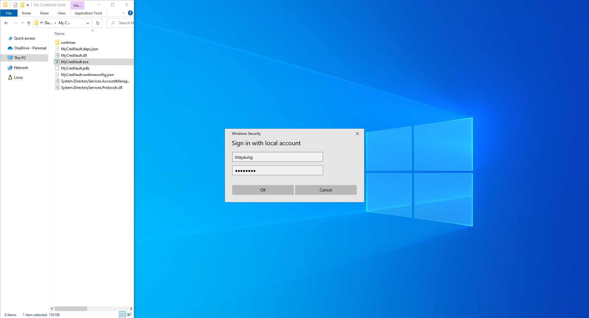
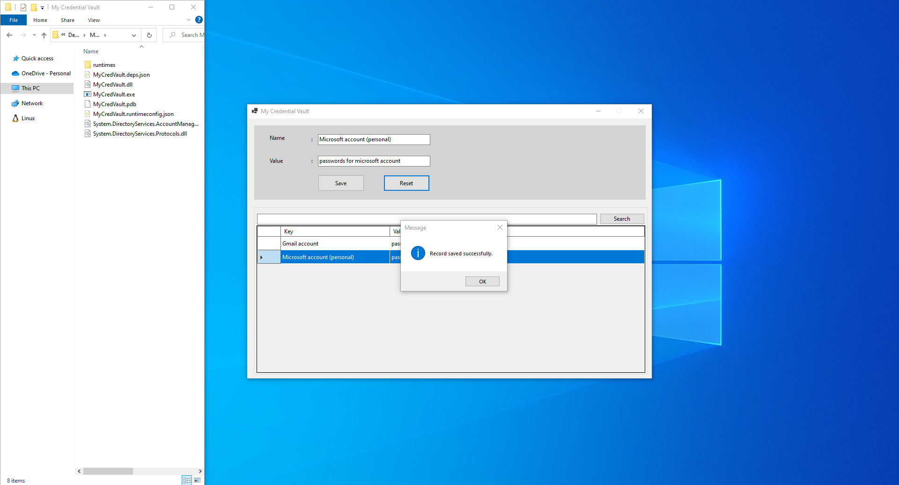
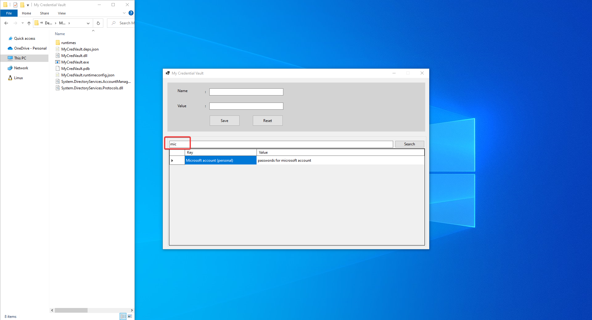
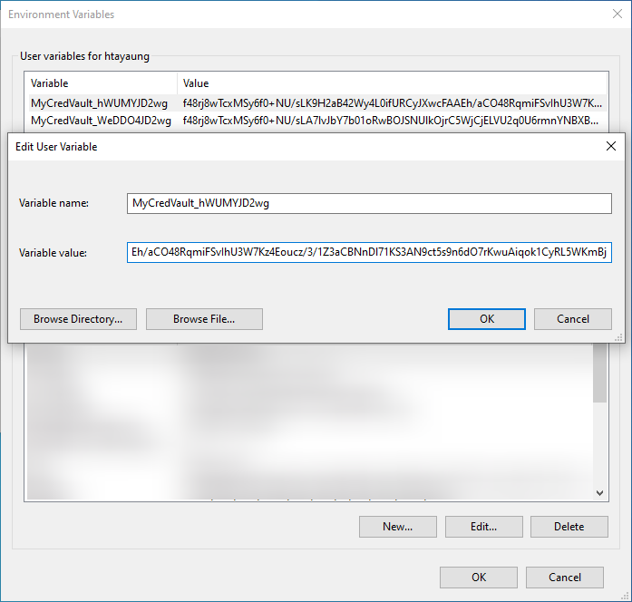

# Overview

The idea for this demo is to store credentials in Windows' environment variables by encrypting with AES. I think it is better than storing as plain text.

## Technologies used
* C#
* .NET 7
* Windows Forms
* [AES algorithm](https://learn.microsoft.com/en-us/dotnet/api/system.security.cryptography.aes?view=net-8.0)

## Screenshots

  
  
  
  

## References
1. https://stackoverflow.com/questions/15009423/way-to-generate-a-unique-number-that-does-not-repeat-in-a-reasonable-time
2. https://learn.microsoft.com/en-us/dotnet/api/system.security.cryptography.aes?view=net-8.0
3. https://www.pinvoke.net/default.aspx/credui.CredUnPackAuthenticationBuffer